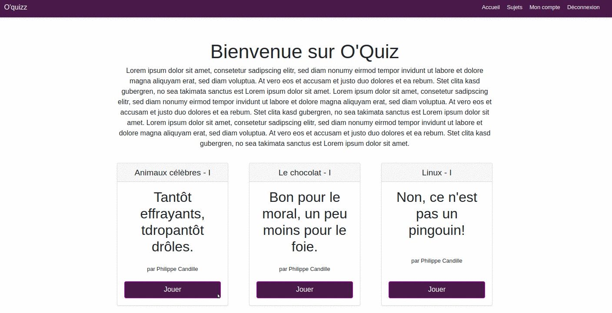

# 2021-S05-Quizz
Quizz  using MVC architecture, EJS and PostgreSQL.

## How to start ?
1. Create BDD
2. Create .env with BDD configuration
3. Run sql scripts : app/data/import_tables.sql and import_data.sql
4. npm i
5. npm start

## How does it look ?

  
